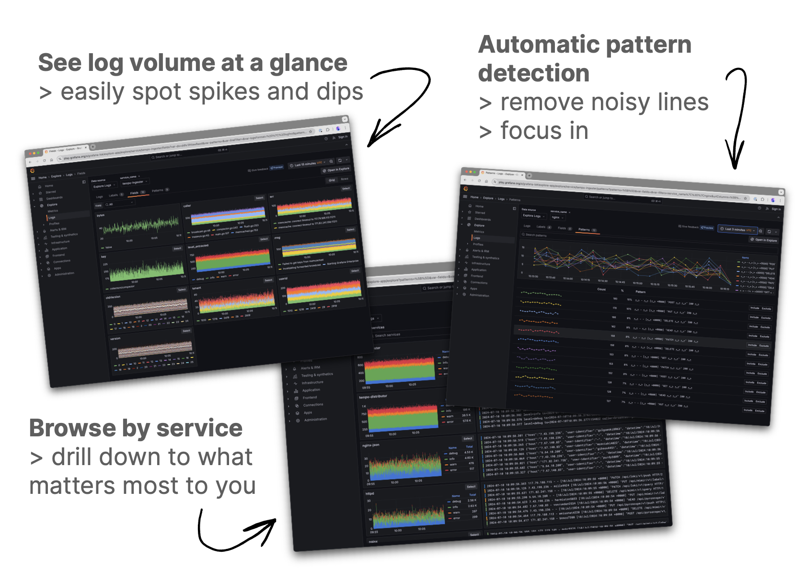
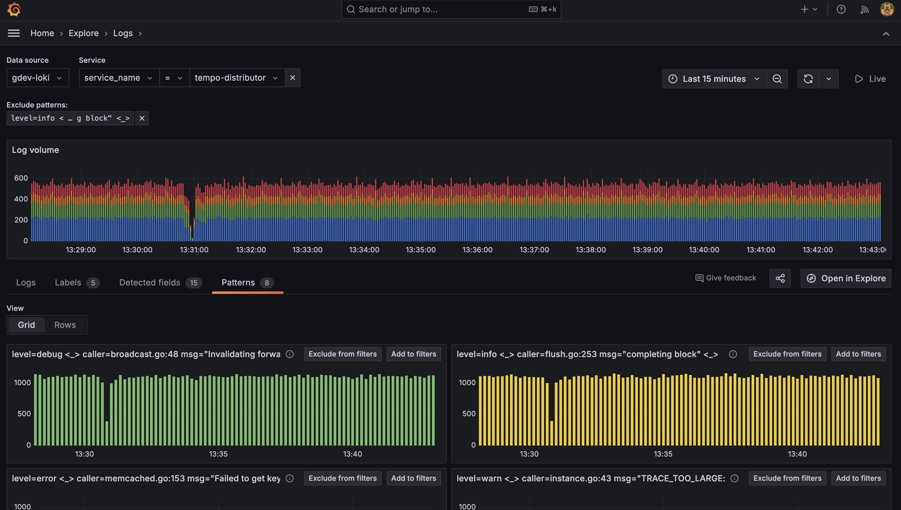

# Explore Logs

> **__NOTE:__** Explore Logs is presently undergoing active development and is offered in a preview state. Subsequent updates are likely to incorporate significant changes that may impact existing functionality. 

Explore Logs offers a query-less experience for browsing Loki logs without the need for writing complex queries. Discover or narrow down your search using by volume and text patterns. Uncover related logs and understand patterns—all with just a few clicks. No LogQL required. With Explore Logs, you can:

- Easily find logs and log volumes for all of your services
- Effortlessly filter service logs based on their log volumes, labels, fields, or patterns.
- Automatically choose the best visualization for your log data based on its characteristics, without any manual setup.

...all without crafting a single query!



## Installation in Your Own Grafana Instance

You can install Explore Logs in your own Grafana instance using `grafana-cli`:
> [!IMPORTANT]  
> The following Loki and Grafana version and configuration are required:
> - Loki v 3.0+
>   - `--pattern-ingester.enabled=true` for pattern ingestion
>   -  Volume endpoint enabled in Loki config:
> ```yaml
>limits_config:
>  volume_enabled: true
>```
> - Grafana v11.0+

```sh
grafana-cli --pluginUrl=https://storage.googleapis.com/integration-artifacts/grafana-lokiexplore-app/grafana-lokiexplore-app-latest.zip plugins install grafana-lokiexplore-app
```

### Installation via environment variables

If you want to [install the app in a docker container](https://grafana.com/docs/grafana/latest/setup-grafana/configure-docker/#install-plugins-in-the-docker-container), you need to configure the following environment variable:

```
GF_INSTALL_PLUGINS=https://storage.googleapis.com/integration-artifacts/grafana-lokiexplore-app/grafana-lokiexplore-app-latest.zip;grafana-lokiexplore-app
```

## Test Out with Docker Compose

Test out the app using the following command to spin up Grafana, Loki, and the Logs Explore App:

```sh
curl -L https://github.com/grafana/explore-logs/raw/main/scripts/run.sh | sh
```

This will download the https://github.com/grafana/explore-logs/blob/main/scripts/run.sh file and execute it. That shell file will download some configuration files into your `/tmp/explore-logs` directory and start the docker containers via `docker compose` from there.

Once the docker container started, navigate to http://localhost:3000/a/grafana-lokiexplore-app/explore in order to use Explore Logs.

## Getting Started

1. In the main navigation bar click on Explore > Logs
2. You’ll land in the service overview page that shows time series and log visualizations for all the services in your selected Loki instance.
3. Change your data source with the drop-down on the top left.
4. Modify your time range in two ways:
   - With the standard time range picker on the top right.
   - By clicking and dragging the time range you want to see on any time series visualization.
5. Services are shown based on the volume of logs, and you can search for the service you want through the Search service input.
6. Select the service you would like to explore. This takes you to the Service page.
7. Filter logs based on strings, labels, fields, or detected patterns.



## Community Resources, Feedback, and Support

- Found a bug? Want a new feature? Feel free to open an [issue](https://github.com/grafana/loki-explore/issues/new).
- Have a question? You can also open an issue, but for questions, it is recommended to use the [Grafana Community](https://community.grafana.com/) portal.
- Have feedback? Please contact us through the [Grafana Logs Feedback](https://docs.google.com/forms/d/e/1FAIpQLSdcnzb0QYBqzp3RkrXIxqYKzDdw8gf0feZkOu4eZSIPyTUY1w/viewform) form.

## Development

In order to run the setup locally and build the plugin by your own, follow these steps:

1. `yarn install` 
2. `yarn dev` this builds the plugin continuously
3. `yarn server` this spins up the docker setup, including a Loki instance and the fake data generator

## Supported Features

This section outlines the supported features available by page: Service Selection and Service Detail.

### Service Selection

Service Selection is the entry step where users can choose a service. List of features and functionalities:

**1. Fetching of services** - Services are fetched using the Loki [/loki/api/v1/index/volume](https://grafana.com/docs/loki/latest/reference/loki-http-api/#query-log-volume) endpoint and ordered by their volume. Services are re-fetched when the time range significantly changes to ensure correct data. Services are updated if:
- The time range scope changes (hours vs. days).
- The new time range is under 6 hours and the difference exceeds 30 minutes.
- The new time range is under 1 day and the difference exceeds 1 hour.
- The new time range is over 1 day and the difference exceeds 1 day.

**2. Showing of services** - Services are shown based on volume and are lazy-loaded. Metrics and logs are queried only for services that are scrolled to.

**3. Previously selected services** - Previously selected services are displayed at the top of the list for easier access.

**4. Searching of services** - The search input can be used to filter services that include the specified string.

### Service Details
