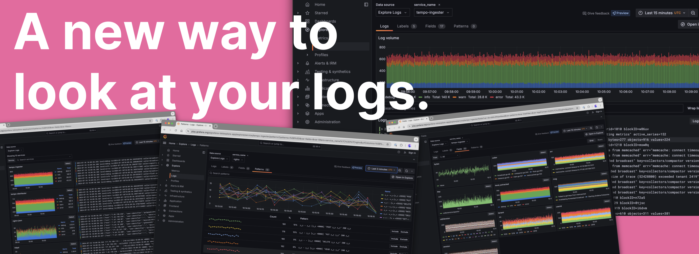
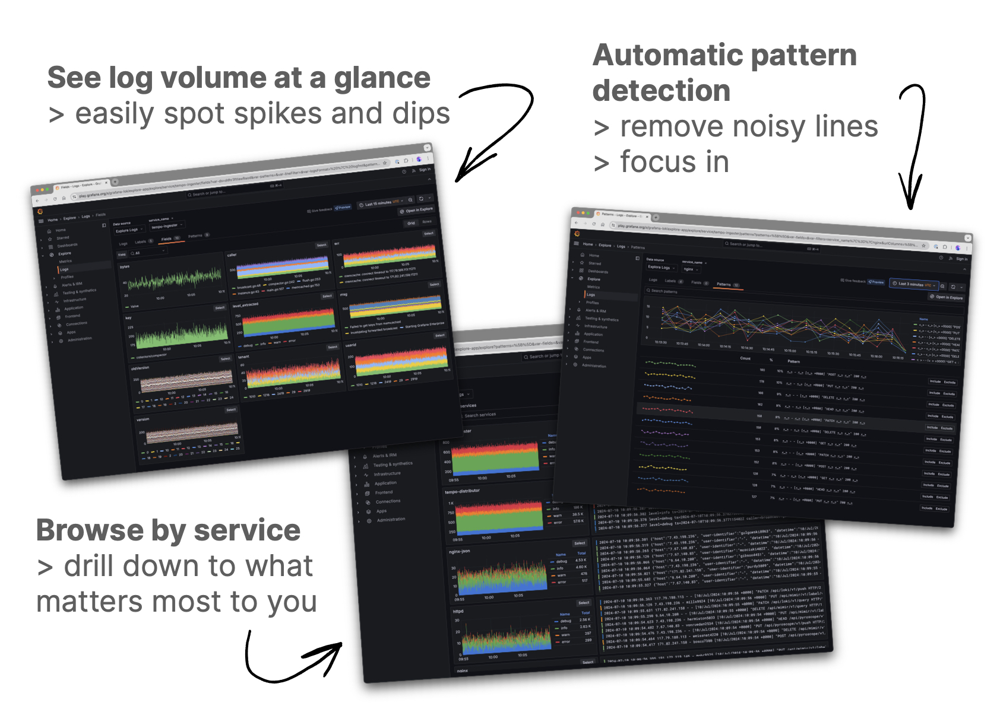

  
Explore Logs is currently in [public preview](/docs/release-life-cycle/). Grafana Labs offers limited support, and breaking changes might occur prior to the feature being made generally available.


# Explore Logs

Welcome to our new experience for Loki. Explore Logs automatically visualizes insights.

You can:

- **Drill into your** data using volume and text patterns.
- **Easily find logs and log volumes** for all of your services.
- Effortlessly **filter logs based on their labels, fields, or patterns**.
- Uncover **related logs** and monitor changes over time.
- Browse **automatic visualizations of your log data** based on its characteristics.
- Do all of this **without writing LogQL queries**.

## Who is Explore Logs for?

Explore Logs is for engineers of all levels of operational expertise. You no longer need to be an SRE wizard to get value from your logs.

Traditionally, you'd need a deep understanding of your systems in order to get the most out of Loki.

With Explore Logs, you get the same powerful insights, by just clicking around and glancing at visualizations which are automatically generated from your data.

## Learn more

Check out the following articles to learn more about Explore Logs:


 
If you're having trouble using Explore Logs, check out our [troubleshooting guides]().

## Please share your feedback

Our new experiences are in their early stages, and we'd love to hear your feedback.

- You'll find a **Give feedback** link on the Explore Logs page in Grafana.
- You can also [fill out this form](https://forms.gle/1sYWCTPvD72T1dPH9) to send your thoughts directly to the team building the apps.

## What's next?

Dive into the [Get started with Explore Logs]() article to learn how to set up Explore Logs and take a tour of the feature on your own data.
