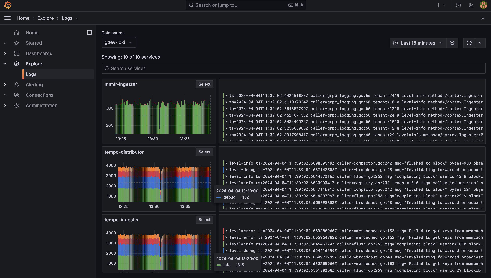
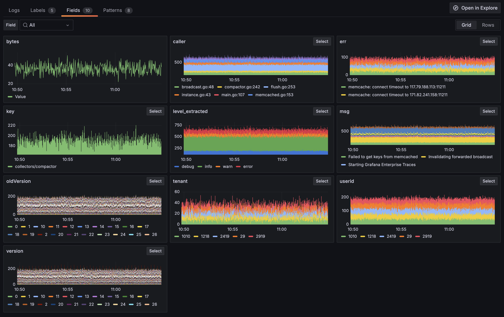

  
Explore Logs is currently in [public preview](/docs/release-life-cycle/). Grafana Labs offers limited support, and breaking changes might occur prior to the feature being made generally available.


# Get started with Explore Logs

The best way to see what Explore Logs can do for you is to use it to explore your own data.


See also instructions for how to [access or install Explore Logs]().


## Set up a new Loki datasource

In order to access your logs through Explore Logs, you will need to configure a datasource in Grafana.

If you already use **Explore** to query your logs, you can skip this section.

1. Log into your Grafana instance. If this is your first time running Grafana, the username and password are both defaulted to `admin`.
1. In Grafana, go to **Connections** > **Data Sources** via the cog icon on the left sidebar.
1. Click the big **+ Add a new data source** button.
1. Search for, or choose **Loki** from the list.
1. The **http URL** field should be the address of your Loki server. For example, when running locally or with Docker using port mapping, the address is likely `http://localhost:3100`.

   When running with docker-compose or Kubernetes, the address is likely `http://loki:3100`.

   When running Grafana (with Docker) and trying to connect to a locally built Loki instance, the address (for the URL field) is:

   On Mac: `docker.for.mac.localhost`
   On Windows: `docker.for.win.localhost`

## Guide

We will walk through a simple step-by-step guide providing a tour of Explore Logs.

While you are browsing around the app, look out for any unexpected spikes. Or perhaps one of your services is down and has stopped logging. Maybe you're seeing an increase in errors after a recent release.

To take a tour of Explore Logs, follow these steps:

1. In the main navigation bar click on **Explore** > **Logs**.
2. You’ll land on the **Service overview page** showing time series and log visualizations for all the services in your selected Loki instance. ([No services?]())
3. Change your data source with the drop-down on the top left, and select a recent time range.
   
   You can modify your time range in two ways:
   - With the standard time range picker on the top right.
   - By clicking and dragging the time range on any time series visualization.
     
4. Services are shown based on the volume of logs, or you can search for the service by name.
5. Click **Select** on the service you would like to explore.
6. Click on the **Labels** tab to see visualizations of the log volume for each label. ([No labels?]())
7. Select a label to see the log volume for each value of that label.    Explore Logs shows you the volume of logs with specific Labels and fields. Learn more about [Labels and Fields]().  

8. Select the **Fields** tab to see visualizations of the log volume for each Field. You can drill down in the same way.
9. Click on the **Patterns** tab to see the log volume for each automatically detected pattern.    Log patterns allow you to work with groups of similar log lines. You can hide them if they're noise, or focus in on them if they're useful. Learn more about [Log Patterns]().

### What do you think?

Please [share your feedback](https://forms.gle/1sYWCTPvD72T1dPH9) and help make Explore Logs better.

# What next?

Learn more about how Explore Logs makes it easy to work with [Labels and Fields]().
